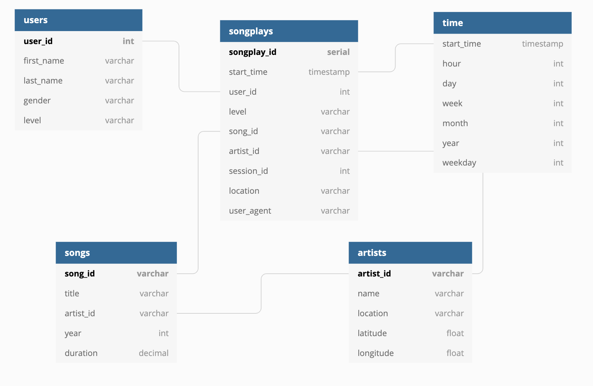

# Sparkify

Sparkify is a music streaming app that's interested in what songs users are listening to.
For example, they may want to create playlists of the top hits in the USA. In order to 
more easily query their data, they need to move their JSON song and log files into a database.
This project moves that data into a PostgreSQL database via an ETL pipeline.

## Database schema

This schema uses the star schema format where songplays is the fact table and artists, songs,
users, and time are the dimension tables because Sparkify is most interested in what songs are
actually getting played. This allows us to more easily aggregate the data around song plays.

The `songs` and `artists` tables are populated by the song_data files. While `time`, `users`,
and `songplays` comes from our log_data files.

## Running the project

First create the tables by running:
`python create_tables.py`

Next execute the ETL pipeline by running:
`python etl.py`